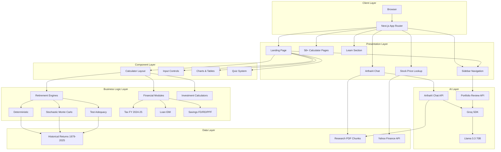
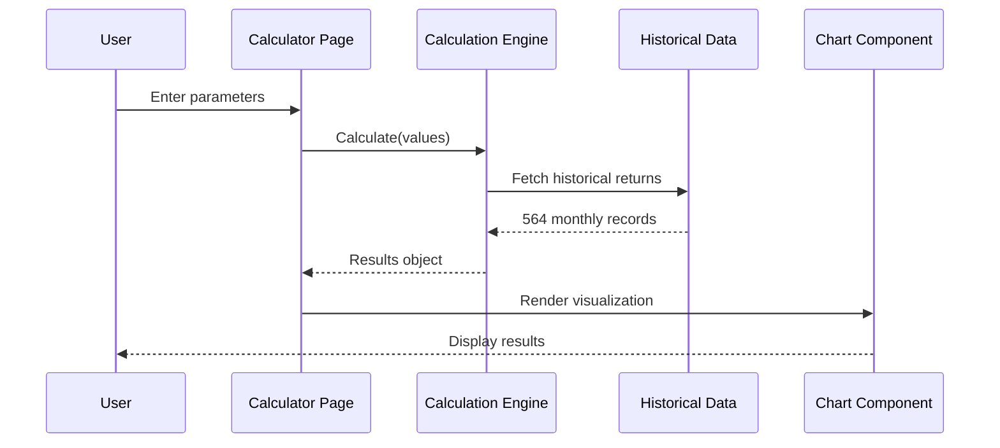
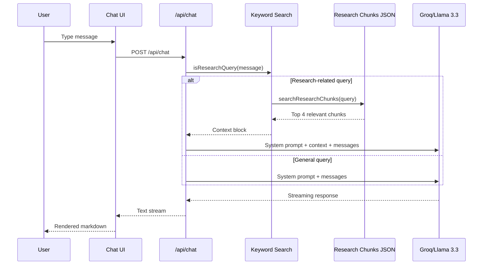
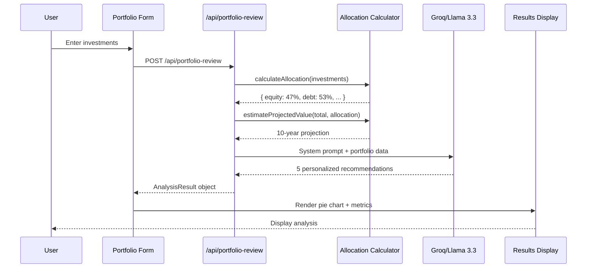
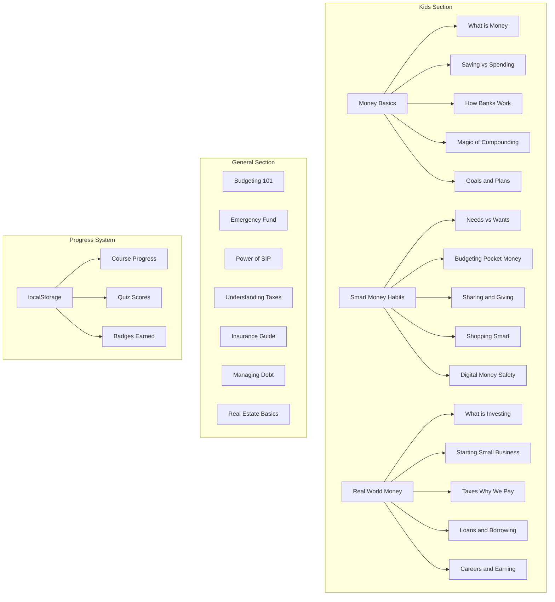
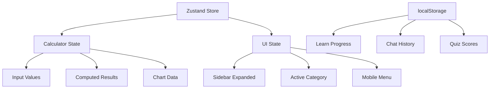

# RupeeMap

A production-ready financial calculator web application with 58+ calculators, AI-powered chatbot, portfolio analysis, and interactive financial literacy platform.

## Overview

RupeeMap is a comprehensive personal finance tool built with Next.js 16, featuring retirement planning calculators, investment tools, loan calculators, tax planning, insurance analysis, AI-powered portfolio review, and a RAG-powered AI chatbot (ArthaAI) for financial guidance with Indian market context.

## Tech Stack

| Category | Technology |
|----------|-----------|
| Framework | Next.js 16 (App Router, Turbopack) |
| UI Library | React 19 |
| Language | TypeScript 5 |
| Styling | TailwindCSS 4 |
| Components | shadcn/ui (base-nova with @base-ui/react) |
| Animation | Framer Motion |
| Charts | Recharts |
| State | Zustand |
| AI | Groq SDK (Llama 3.3 70B) |
| PDF Parsing | unpdf |
| Forms | React Hook Form + Zod |
| Export | jsPDF, xlsx |

## Project Structure

```
AIFinanceRupeeMap/
├── public/
│   ├── logo.png                          # RupeeMap logo
│   └── research/
│       └── ssrn-5381648-dynamic.pdf      # Research paper for RAG
├── scripts/
│   └── parse-pdf.js                      # PDF → JSON chunks parser
├── src/
│   ├── app/                              # Next.js App Router pages
│   │   ├── api/                          # API routes
│   │   │   ├── chat/route.ts             # ArthaAI streaming endpoint
│   │   │   ├── portfolio-review/route.ts # AI portfolio analysis
│   │   │   ├── mutual-fund-search/route.ts # MFAPI search proxy
│   │   │   ├── mutual-fund-data/route.ts   # MFAPI NAV data proxy
│   │   │   ├── stock-price/route.ts      # Yahoo Finance price proxy
│   │   │   └── stock-search/route.ts     # Yahoo Finance search proxy
│   │   ├── learn/                        # Financial literacy section
│   │   │   ├── [course]/[lesson]/        # Kids lessons with quizzes
│   │   │   └── general/[topic]/          # General finance articles
│   │   ├── chat/                         # ArthaAI chat interface
│   │   ├── portfolio-review/             # AI portfolio analysis page
│   │   ├── fund-compare/                 # Mutual fund comparison page
│   │   ├── deterministic/                # Retirement calculators
│   │   ├── stochastic/
│   │   ├── what-if/
│   │   ├── test-adequacy/
│   │   ├── withdrawal-rates/
│   │   ├── history/
│   │   ├── sip-calculator/               # Investment calculators
│   │   ├── lumpsum-calculator/
│   │   ├── stock-price/
│   │   ├── ...                           # 58+ calculator pages
│   │   └── page.tsx                      # Landing page
│   ├── components/
│   │   ├── ui/                           # shadcn/ui primitives
│   │   ├── sidebar.tsx                   # Fixed sidebar navigation
│   │   ├── footer.tsx                    # Site footer
│   │   ├── calculator-layout.tsx         # 12-col grid layout
│   │   ├── input-controls.tsx            # InputField, SliderField
│   │   ├── summary-cards.tsx             # Glass metric cards
│   │   ├── results-table.tsx             # Results display
│   │   ├── chart-components.tsx          # Recharts wrappers
│   │   ├── quiz-card.tsx                 # Quiz component
│   │   ├── lesson-layout.tsx             # Lesson page wrapper
│   │   ├── chat-message.tsx              # Chat bubble with markdown
│   │   ├── portfolio-form.tsx            # Portfolio entry form
│   │   ├── portfolio-analysis.tsx        # Portfolio results display
│   │   └── fund-compare-card.tsx         # Fund comparison card
│   ├── types/
│   │   ├── portfolio.ts                  # Portfolio data types
│   │   └── mutual-fund.ts                # Mutual fund data types
│   ├── lib/
│   │   ├── calculations/                 # Core calculation engines
│   │   │   ├── math.ts                   # SWR formula, utility functions
│   │   │   ├── retirement.ts             # Deterministic calculator
│   │   │   ├── stochastic.ts             # Monte Carlo simulation
│   │   │   ├── inflation.ts              # Inflation adjustment
│   │   │   └── compound.ts              # Compound interest
│   │   ├── financial/                    # Financial modules
│   │   │   ├── tax.ts                    # Income tax (FY 2024-25)
│   │   │   ├── loan.ts                   # EMI, amortization
│   │   │   ├── savings.ts                # FD, RD, PPF, EPF
│   │   │   ├── gst.ts                    # GST calculations
│   │   │   └── insurance.ts             # Insurance needs
│   │   ├── learn-data.ts                 # Kids course content
│   │   ├── general-learn-data.ts         # General articles
│   │   └── utils.ts                      # Utility functions
│   └── data/
│       ├── historical-returns.ts         # 564 monthly records (1979-2025)
│       └── research-chunks.json          # 51 RAG chunks from PDF
├── SESSION_STATE.md                       # Development state
├── DESIGN_BRIEF.md                        # Design specifications
└── package.json
```

## Architecture

### High-Level Architecture



### Module Architecture

```mermaid
graph LR
    subgraph "Calculators"
        A[Retirement] --> A1[Deterministic]
        A --> A2[Stochastic]
        A --> A3[Test Adequacy]
        A --> A4[What-if]
        A --> A5[Withdrawal Rates]
        A --> A6[History Back-test]

        B[Investment] --> B1[SIP]
        B --> B2[Lumpsum]
        B --> B3[Step-up SIP]
        B --> B4[SWP]
        B --> B5[STP]
        B --> B6[Goal Planner]
        B --> B7[CAGR]
        B --> B8[XIRR]
        B --> B9[Stock Prices]
        B --> B10[Portfolio Review]

        C[Loan] --> C1[EMI]
        C --> C2[Home Loan]
        C --> C3[Car Loan]
        C --> C4[Personal Loan]
        C --> C5[Education Loan]
        C --> C6[Loan Comparison]
        C --> C7[Prepayment]

        D[Tax] --> D1[Income Tax]
        D --> D2[Old vs New Regime]
        D --> D3[HRA]
        D --> D4[Gratuity]
        D --> D5[Section 80C]

        E[Savings] --> E1[FD]
        E --> E2[RD]
        E --> E3[PPF]
        E --> E4[EPF]
        E --> E5[NPS]
        E --> E6[Sukanya]
        E --> E7[NSC]
        E --> E8[SCSS]
    end
```



### Data Flow Architecture



### ArthaAI RAG Architecture



### Portfolio Review Architecture



### Learn Section Architecture



### State Management



## Features

### 58+ Financial Calculators
- **Retirement**: Deterministic, Stochastic, Test Adequacy, What-if, Withdrawal Rates, History Back-test
- **Investment**: SIP, Lumpsum, Step-up SIP, SWP, STP, Goal Planner, CAGR, XIRR, Returns, Stock Prices, Fund Compare
- **Loan**: EMI, Home, Car, Personal, Education, Eligibility, Affordability, Balance, Comparison, Prepayment
- **Tax**: Income Tax, Old vs New Regime, HRA, Gratuity, Leave Encashment, Section 80C
- **Savings**: FD, RD, PPF, EPF, NPS, Sukanya, NSC, SCSS
- **Insurance**: Life Insurance Need, Term Insurance, Child Education, Health Insurance
- **Business**: GST, Discount, Break-even, Profit Margin
- **General**: Inflation, Purchasing Power, Rule of 72, Compound/Simple Interest, Future/Present Value

### ArthaAI Chatbot
- Streaming responses via Groq SDK (Llama 3.3 70B)
- RAG-powered with 51 research paper chunks
- Indian financial context (₹, PPF, NPS, ELSS, Nifty 50, SEBI)
- Rate limiting (15 requests/minute)
- Chat history persistence (localStorage)
- Markdown rendering with tables, lists, code blocks

### AI Portfolio Review
- Groq-powered portfolio analysis with personalized recommendations
- Investment entry form with templates (Moderate ₹50L, Aggressive ₹25L)
- Dynamic add/remove investments with category classification
- Asset allocation pie chart (equity, debt, gold, real estate, other)
- Risk score assessment (low/medium/high) based on age, profile, and allocation
- 10-year projected value based on weighted category returns
- AI-generated recommendations (rebalancing, tax optimization, diversification)

### Financial Literacy Platform
- **Kids Section**: 15 lessons across 3 courses with quizzes
- **General Section**: 7 in-depth articles with real-world Indian examples
- Progress tracking via localStorage
- Badge system for course completion

### Design System
- Dark-first glassmorphism (Google Stitch inspired)
- Colors: Deep navy `#0d1320` bg, Cyan `#89ceff` primary, Emerald `#4edea3` secondary
- Fixed sidebar navigation with expandable categories
- Responsive design (mobile + desktop)
- JetBrains Mono for data, Geist for narrative

## Getting Started

### Prerequisites
- Node.js 18+
- npm or yarn

### Installation

```bash
git clone <repository-url>
cd AIFinanceRupeeMap
npm install
```

### Environment Variables

Create `.env.local`:
```
GROQ_API_KEY=your_groq_api_key_here
```

### Development

```bash
npm run dev
```

Open [http://localhost:3000](http://localhost:3000)

### Production Build

```bash
npm run build
npm start
```

## API Endpoints

| Endpoint | Method | Description |
|----------|--------|-------------|
| `/api/chat` | POST | ArthaAI streaming chat (Groq SDK) |
| `/api/portfolio-review` | POST | AI portfolio analysis (Groq SDK) |
| `/api/stock-price` | GET | Yahoo Finance price proxy |
| `/api/stock-search` | GET | Yahoo Finance search proxy |

## Data Sources

- **Historical Returns**: 564 monthly records (1979-2025) for Indian equity and debt markets
- **Research Paper**: "Boosting Retirement Income through Dynamic Withdrawals" (SSRN 5381648) - parsed into 51 chunks for RAG
- **Stock Data**: Yahoo Finance API (free, no key required)

## Tax Calculations

### New Regime (FY 2024-25)
| Income Slab | Tax Rate |
|-------------|----------|
| 0 - 3,00,000 | 0% |
| 3,00,001 - 7,00,000 | 5% |
| 7,00,001 - 10,00,000 | 10% |
| 10,00,001 - 12,00,000 | 15% |
| 12,00,001 - 15,00,000 | 20% |
| Above 15,00,000 | 30% |

- Standard Deduction: ₹75,000
- Section 87A Rebate: For income ≤ ₹7,00,000
- Health & Education Cess: 4%

### Old Regime (FY 2024-25)
| Income Slab | Tax Rate |
|-------------|----------|
| 0 - 3,00,000 | 0% |
| 3,00,001 - 6,00,000 | 5% |
| 6,00,001 - 9,00,000 | 10% |
| 9,00,001 - 12,00,000 | 15% |
| 12,00,001 - 15,00,000 | 20% |
| Above 15,00,000 | 30% |

## Development History

See [SESSION_STATE.md](./SESSION_STATE.md) for detailed development state and history.

## License

Private - All rights reserved.
